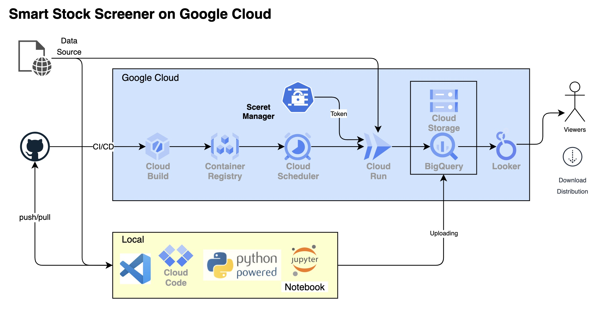
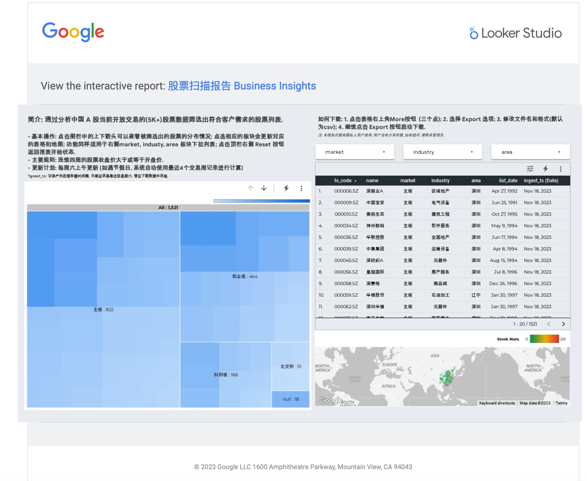

# Google Cloud 上的智能股票筛选框架（Privite 项目）

[ENGLISH](README.md)

## 简介 Description

欢迎使用 Google 云平台上的智能股票筛选框架！ 该项目是个人构建强大的股票搜索工具的一种设计思路，该工具使用户能够为精确的股票搜索制作定制的过滤器和指标。

## 系统设计 System Design

1. 创建新的 Google Cloud 项目或选择现有项目。
2. 创建 Cloud Storage 存储桶来存储原始数据文件作为备份。
3. 创建几个 BigQuery 表来存储原始数据文件以及处理后的数据和报告结果。
4. 使用 Secret Manager 存储 API 密钥和令牌。
5. 使用Github作为项目存储库。
6. 用 Python 开发股票筛选策略。
7. 使用 Cloud Build for CI/CD 将 Python 代码与 Docker 映像容器化，并将映像推送到 Artifact Registry。
8. 创建 Cloud Run 作业来运行库存筛选批处理。
9. 创建 Cloud Scheduler 作业以按指定时间间隔触发 Cloud Run 作业。
10. 使用 Looker 进行数据可视化、仪表板设计和报告 (BI) 并向利益相关者发送电子邮件

### 程序的主要步骤（即App.py）

使用 conda、gloud cli 设置本地开发环境以进行代码开发或使用 Vertex AI Notebook。

1. 从秘密管理器获取令牌。
2. 使用令牌连接到服务器并将库存列表数据获取到定义了 dtype 的 pandas 数据框中。
3. 预处理数据并格式化。
4. 将数据帧写入 BigQuery 表并作为备份 csv 文件上传到 Bucket
5. 应用选股方法获得备案的名单。
6. 将输出保存到 BigQuery。

注意：对于不同的方法，考虑应用不同的并行计算策略。

### 用户收到电子邮件样本

## 总结 Summary

以下 Google Cloud 服务用于构建此框架：

- 云存储：转储任何数据文件作为备份。
- BigQuery：存储结构化输入/输出表以供分析和报告。
- 秘密管理器：存储股票API令牌。
- 云构建：构建代码的 Docker 镜像并推送到 ArtifactRegistry。
- ArtifactRegistry：存储具有版本控制和功能的 Docker 映像。
- Cloud Run：托管股票筛选作业以运行批处理。
- Cloud Scheduler：安排 Cloud Run 作业以指定的时间间隔运行。
- （可选）Vertex AI：训练和部署任何模型并进行预测并将结果存储在 BigQuery 中以供审核和分析。

## 特点 Features

- Comprehensive Filters 自定义全面的过滤器：使用广泛的过滤器精确定制股票筛选标准，专注于挑选符合投资目标的股票。
- Customized Metrics: 自定义指标：定义您自己的绩效指标和指标来评估股票，使您能够灵活地确定对您的投资策略最重要的优先顺序。

## Why Choose This Framework? 为什么选择这个框架？

- 云驱动：利用 Google Cloud 强大的基础设施，该框架可确保可扩展性、可靠性和实时数据分析，满足您的股票筛选需求。

- 用户友好：直观的界面使各个级别的用户都可以轻松创建、修改和执行股票筛选策略。

- 开源：该项目将是开源的，促进协作和社区驱动的增强功能，以不断发展和改进股票筛选体验。

## What's Next 下一步是什么

探索文档和代码库，开始在 Google Cloud 上构建您的个性化股票筛选工具。 无论您是经验丰富的投资者还是刚刚起步的投资者，此设计都能提供您做出明智的投资决策所需的工具和灵活性。参考该项目，可以彻底改变你搜索股票、发现隐藏机会并掌控您的投资组合的方式.