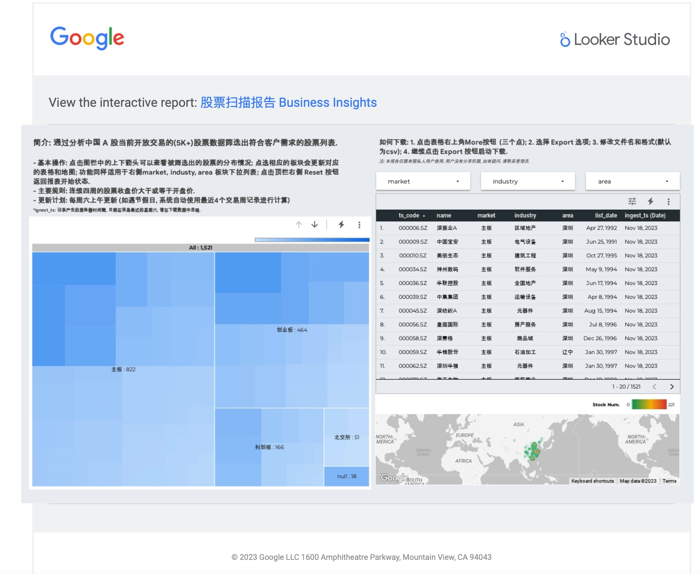

# Smart Stock Screener Framework on Google Cloud (Private)

[中文](README.CN.md)

## Description

Welcome to the Smart Stock Screener Framework on Google Cloud Platform! This project is a gateway to build a powerful personal stock search tool that empowers users to craft customized filters and metrics for precision stock hunting.

## System Design

1. Create a new Google Cloud project or select an existing project.
2. Create a Cloud Storage bucket to store the raw datafile as backup.
3. Create few BigQuery tables to store the raw datafile and the processed data and results for reporting.
4. Use Secret Manager to store API keys and tokens.
5. Use Github as project repository.
6. Develop the stock screening strategy in Python.
7. Use Cloud Build for CI/CD to Containerize the Python codes with Docker Images and push image(s) to Artifact Registry.
8. Create a Cloud Run Job to run the stock screening batch process.
9. Create a Cloud Scheduler job to trigger the Cloud Run Job at a specified time interval.
10. Use Looker for data visualization, dashboard design & reporting (BI) and send emails to stakeholders

### Main Steps of Program (i.e., App.py)

Setup your local dev-environment with conda, gcloud cli for code development or use Vertex AI Notebook.

1. Get the token from the secret manager.
2. Use the token to connect to the server and get the stock list data into a pandas dataframe with dtype defined.
3. Pre-process the data and formatting.
4. Write dataframe into the BigQuery table and upload to Bucket as backup csv files
5. Apply the stock selection methods to get the filed the list.
6. Save the output to BigQuery.

Note: for different methods, consider applying different parallel computing strategics.

### User received email sample

## Summary

The following Google Cloud services to build this framework:

- Cloud Storage: dump any datafile as backup.
- BigQuery: store the structured input/output tables for analysis and reporting.
- Secret Manager: store the stock api token.
- Cloud Build: build the Docker images of the code and push to Artifact Registry.
- Artifact Registry: store the Docker images with versioning and functionality.
- Cloud Run: host the stock screening job to run batch process.
- Cloud Scheduler: schedule the Cloud Run job to run at a specified time interval.
- (Optional) Vertex AI: train and deploy any models and make predictions and store the results in BigQuery for review and analysis.

## Features

- Comprehensive Filters: Tailor your stock screening criteria with precision using a wide range of filters, enabling you to focus on stocks that align with your investment goals.

- Customized Metrics: Define your own performance metrics and indicators to evaluate stocks, giving you the flexibility to prioritize what matters most to your investment strategy.

## Why Choose This Framework?

- Cloud-Powered: Leveraging the robust infrastructure of Google Cloud, this framework ensures scalability, reliability, and real-time data analysis for your stock screening needs.

- User-Friendly: Intuitive interfaces make it easy for users of all levels to create, modify, and execute stock screening strategies.

- Open Source: This project will be open source, fostering collaboration and community-driven enhancements for a constantly evolving and improving stock screening experience.

## What's Next

Explore the documentation and codebase to start building your personalized stock screening tool on Google Cloud. Whether you're a seasoned investor or just getting started, this design offers the tools and flexibility you need to make informed investment decisions.

Join this project in revolutionizing the way you search for stocks, uncover hidden opportunities, and take control of your investment portfolio.
